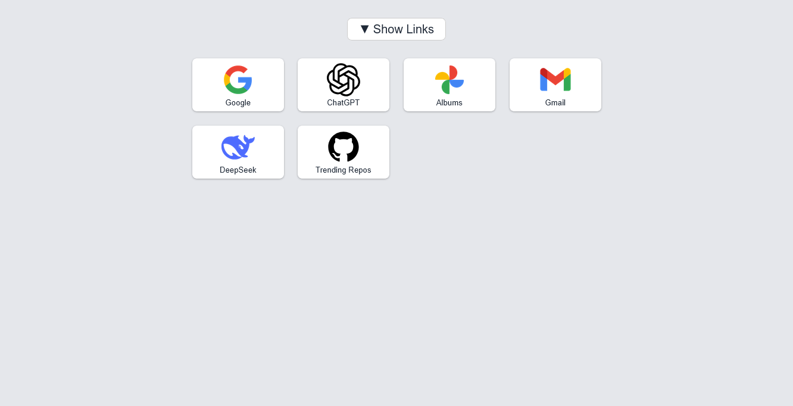

# Quick Links Dashboard

This project displays a customizable grid of quick access link buttons that can be used as a custom browser start page.

---

## 🔧 Customization

To personalize the dashboard:

1. **Edit the grid structure in `data.js`**  
   Each group in `linksData` defines a row of link cards.

2. **Add your own images**  
   Place your logo/icon files in the `images/` folder and reference their paths in `data.js`.

---

## 🚀 How to Use

1. **Download or clone this project**  

2. **Open `index.html` in your browser**

3. **Copy the full file path from the address bar**  
   It should look like:  
   `file:///C:/Path/To/index.html`

4. **Paste this path into your browser’s settings**  
   Look for the setting that allows a **custom URL for a new tab or homepage**, and paste the copied path.

---
